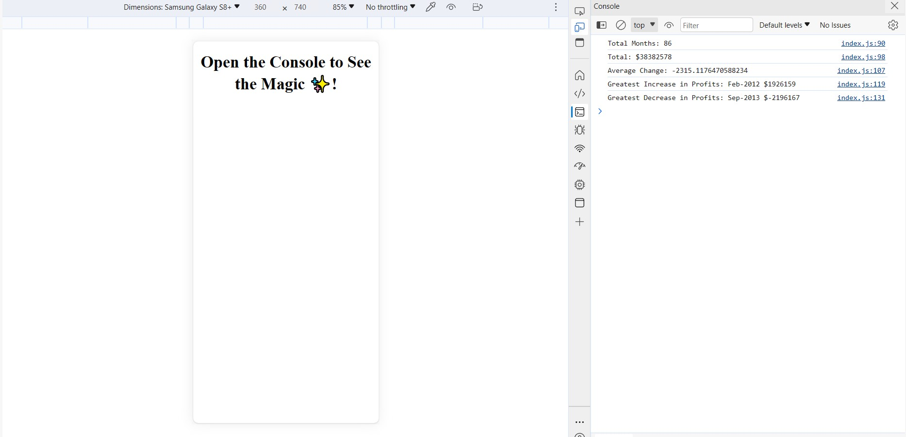

# Console-Finances

## Description

Code for analyzing the financial records of a company:

Deployed application: https://iabramidze.github.io/Console-Finances/

## References

https://stackoverflow.com/questions/966225/how-can-i-create-a-two-dimensional-array-in-javascript - I used this source for this array inside another array thing
(let items = [
  [1, 2],
  [3, 4],
  [5, 6]
];
console.log(items[0][0]); // 1
console.log(items[0][1]); // 2
console.log(items[1][0]); // 3
console.log(items[1][1]); // 4
console.log(items);)